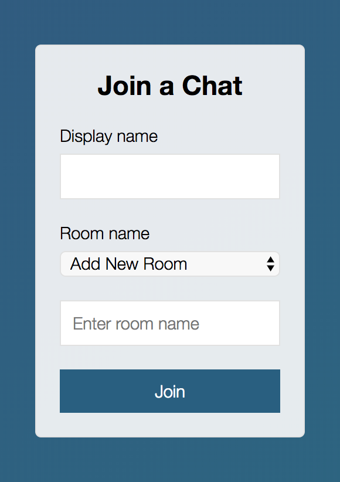
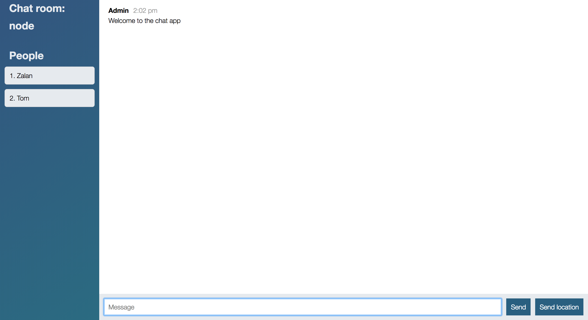

# Node chat app using Socket.io

### Installation

Install the dependencies and devDependencies and start the server.
```sh
$ cd socketio-sample-app
$ npm install
$ npm start
```
### Pictures of the UI:




